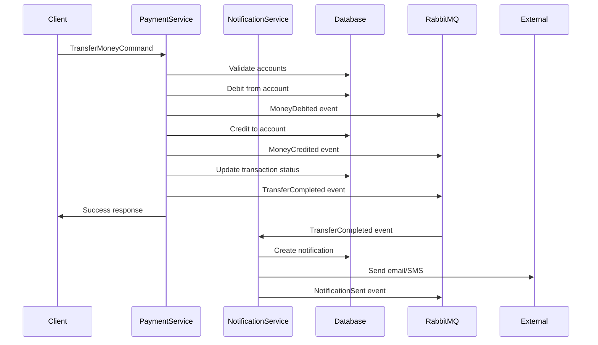
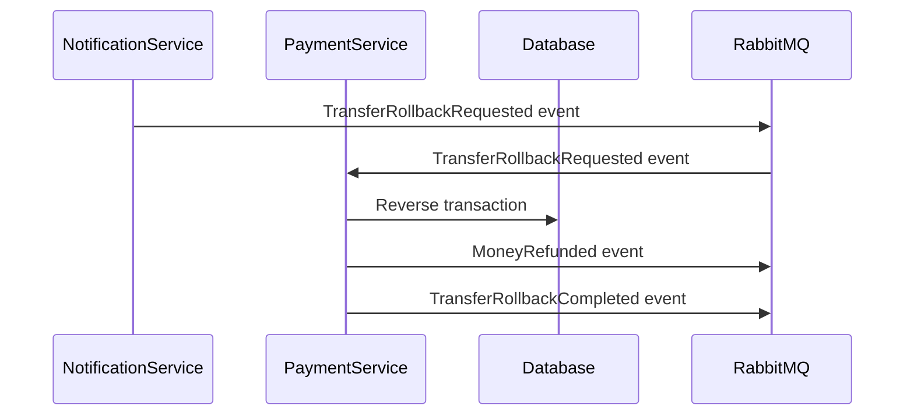

# Architecture Documentation

## System Overview

This microservices platform implements a modern, cloud-native architecture using Azure services and industry best practices.

## Architecture Principles

### 1. Domain-Driven Design (DDD)
- **Bounded Contexts**: Each service represents a distinct business domain
- **Aggregates**: Account and Transaction are the main aggregates
- **Domain Events**: Business events drive the system behavior
- **Value Objects**: Currency, AccountNumber, etc.

### 2. CQRS (Command Query Responsibility Segregation)
- **Commands**: Write operations (TransferMoney, RollbackTransfer)
- **Queries**: Read operations (GetAccount, GetTransaction)
- **Handlers**: Separate handlers for commands and queries
- **Models**: Different models for read and write operations

### 3. Event-Driven Architecture
- **Event Sourcing**: Events represent state changes
- **Event Streaming**: RabbitMQ for reliable message delivery
- **Event Handlers**: Services react to domain events
- **Eventual Consistency**: Services eventually become consistent

### 4. Saga Pattern (Choreography)
- **Distributed Transactions**: Cross-service transaction management
- **Compensation**: Rollback mechanisms for failed operations
- **Orchestration**: Services coordinate through events
- **Idempotency**: Operations can be safely retried

## Service Architecture

### PaymentService

**Responsibilities:**
- Account management
- Transaction processing
- Money transfer operations
- Balance validation

**Key Components:**
```
PaymentService/
├── Controllers/          # API endpoints
├── Handlers/            # CQRS handlers
├── Services/            # Business logic
├── Data/               # Data access layer
└── Models/             # Domain models
```

**Database Schema:**
- `Accounts` table: Account information and balances
- `Transactions` table: Transaction history and status

**Events Published:**
- `MoneyDebited`
- `MoneyCredited`
- `TransferCompleted`
- `TransferFailed`
- `MoneyRefunded`
- `TransferRollbackCompleted`

**Events Consumed:**
- `TransferRollbackRequested`

### NotificationService

**Responsibilities:**
- Email notifications
- SMS notifications
- Notification delivery tracking
- User communication

**Key Components:**
```
NotificationService/
├── Controllers/          # API endpoints
├── Handlers/            # Event handlers
├── Services/            # Business logic
├── Data/               # Data access layer
└── Models/             # Domain models
```

**Database Schema:**
- `Notifications` table: Notification history and status

**Events Published:**
- `NotificationSent`
- `NotificationFailed`

**Events Consumed:**
- `NotificationRequested`
- `TransferCompleted`
- `TransferFailed`

## Data Flow

### Money Transfer Flow



### Rollback Flow



## Infrastructure Architecture

### Azure Services

**Compute:**
- **Azure Kubernetes Service (AKS)**: Container orchestration
- **Container Instances**: For development/testing

**Storage:**
- **Azure PostgreSQL Flexible Server**: Primary database
- **Azure Storage Account**: File storage and logs
- **Azure Key Vault**: Secrets management

**Networking:**
- **Virtual Network**: Network isolation
- **Subnets**: Service separation
- **Network Security Groups**: Traffic filtering
- **Load Balancer**: Traffic distribution

**Monitoring:**
- **Application Insights**: Application monitoring
- **Log Analytics**: Centralized logging
- **Azure Monitor**: Infrastructure monitoring

### Kubernetes Architecture

**Namespaces:**
- `default`: Application services
- `kube-system`: System components
- `ingress-nginx`: Ingress controller

**Deployments:**
- `payment-service`: 2 replicas
- `notification-service`: 2 replicas
- `rabbitmq`: 1 replica (can be scaled)

**Services:**
- `payment-service`: LoadBalancer type
- `notification-service`: LoadBalancer type
- `rabbitmq`: ClusterIP type

**Ingress:**
- Nginx ingress controller
- SSL termination
- Path-based routing

## Security Architecture

### Network Security
- **VNet Isolation**: Services isolated in private subnets
- **NSG Rules**: Restrictive firewall rules
- **Private Endpoints**: Secure database access

### Application Security
- **HTTPS Only**: All communications encrypted
- **Authentication**: JWT tokens (can be added)
- **Authorization**: Role-based access control
- **Input Validation**: FluentValidation

### Container Security
- **Non-root Users**: Containers run as non-root
- **Minimal Images**: Reduced attack surface
- **Security Scanning**: Trivy vulnerability scanning
- **Image Signing**: Container image signing

### Secrets Management
- **Azure Key Vault**: Centralized secrets storage
- **Kubernetes Secrets**: Runtime secret injection
- **Encryption**: Secrets encrypted at rest and in transit

## Scalability & Performance

### Horizontal Scaling
- **AKS Auto-scaling**: Based on CPU/memory metrics
- **Pod Auto-scaling**: HPA for dynamic scaling
- **Load Distribution**: Multiple replicas with load balancing

### Database Scaling
- **Connection Pooling**: Efficient connection management
- **Read Replicas**: Can be added for read scaling
- **Partitioning**: Can be implemented for large datasets

### Caching Strategy
- **Redis**: Can be added for distributed caching
- **Application Caching**: In-memory caching for frequently accessed data
- **CDN**: For static content delivery

### Performance Optimization
- **Async Processing**: Non-blocking operations
- **Batch Processing**: Bulk operations where possible
- **Connection Pooling**: Database connection optimization
- **Compression**: Response compression

## Monitoring & Observability

### Application Monitoring
- **Application Insights**: Performance monitoring
- **Custom Metrics**: Business metrics tracking
- **Distributed Tracing**: Request flow tracking
- **Error Tracking**: Exception monitoring

### Infrastructure Monitoring
- **Azure Monitor**: Infrastructure metrics
- **Kubernetes Metrics**: Container and pod metrics
- **Log Analytics**: Centralized log analysis
- **Alerting**: Proactive issue detection

### Logging Strategy
- **Structured Logging**: JSON format logs
- **Log Levels**: Appropriate log levels
- **Correlation IDs**: Request tracing
- **Centralized Logging**: Single log aggregation point

## Disaster Recovery

### Backup Strategy
- **Database Backups**: Automated PostgreSQL backups
- **Configuration Backups**: Infrastructure as Code
- **Container Images**: Stored in Azure Container Registry

### High Availability
- **Multi-AZ Deployment**: Services across availability zones
- **Load Balancing**: Traffic distribution
- **Health Checks**: Automatic failover
- **Circuit Breakers**: Fault tolerance

### Recovery Procedures
- **RTO (Recovery Time Objective)**: < 1 hour
- **RPO (Recovery Point Objective)**: < 15 minutes
- **Automated Recovery**: Infrastructure recreation
- **Data Recovery**: Point-in-time recovery

## Development Workflow

### Local Development
1. **Docker Compose**: Local service orchestration
2. **Hot Reload**: Development efficiency
3. **Local Database**: PostgreSQL container
4. **Message Queue**: RabbitMQ container

### CI/CD Pipeline
1. **Code Quality**: Linting, formatting, testing
2. **Security Scanning**: Vulnerability detection
3. **Infrastructure Validation**: Terraform plan
4. **Automated Deployment**: Blue-green deployment
5. **Rollback Capability**: Quick rollback on issues

### Testing Strategy
- **Unit Tests**: Business logic testing
- **Integration Tests**: Service integration testing
- **End-to-End Tests**: Full workflow testing
- **Performance Tests**: Load and stress testing
- **Security Tests**: Vulnerability testing

## Future Enhancements

### Planned Features
- **Authentication Service**: JWT-based authentication
- **API Gateway**: Centralized API management
- **Event Store**: Event sourcing implementation
- **CQRS Read Models**: Optimized read models
- **GraphQL API**: Flexible data querying

### Scalability Improvements
- **Microservice Mesh**: Service mesh implementation
- **Event Streaming**: Apache Kafka integration
- **Caching Layer**: Redis implementation
- **CDN Integration**: Global content delivery

### Monitoring Enhancements
- **Custom Dashboards**: Business metrics dashboards
- **Alerting Rules**: Advanced alerting
- **Performance Profiling**: Detailed performance analysis
- **Cost Monitoring**: Resource cost tracking

